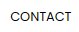

<!--HEADINGS-->
# landing page de la tienda en Linea Fauxia
Se preguntaran que es una Landing Page (página de aterrizaje), es una página dentro de un sitio web, desarrollada con el único objetivo de convertir a los visitantes en Leads o prospectos de ventas atravez de una oferta determinada 

Fauxia es una plataforma de compras en línea ultra-accesible.

## elementos de la  landing page de la tienda en Linea Fauxia
Nuestra pagina web esta conformada por los siguientes elementos:
* Titulo
* subtitulo
* logo
* precio
* imagenes de los productos

### como utilizar nuestra la landing page?

1. Al entrar al sitio web te encontraras con una interfaz en la que contiene dicha información sobre la página.

2.  En el costado derecho de la página podrás observar una miniatura de los productos que se ofrecen y el precio de ellos.

3. Para poder ver los productos solo tendrás que dar un click sobre la imagen que se observa.

4. para poder contactarnos de click en contacto y te enviara a nuestro whatsapp.

